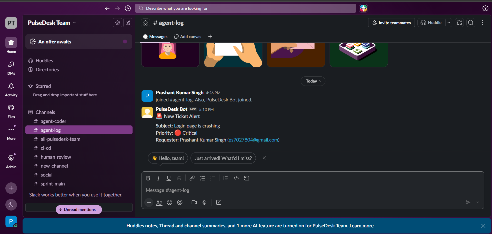
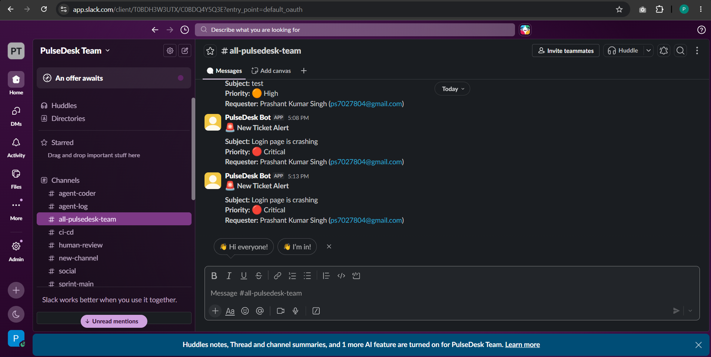
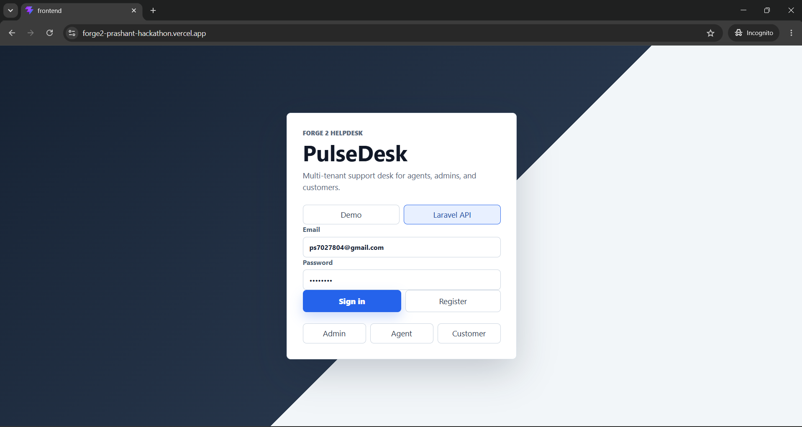
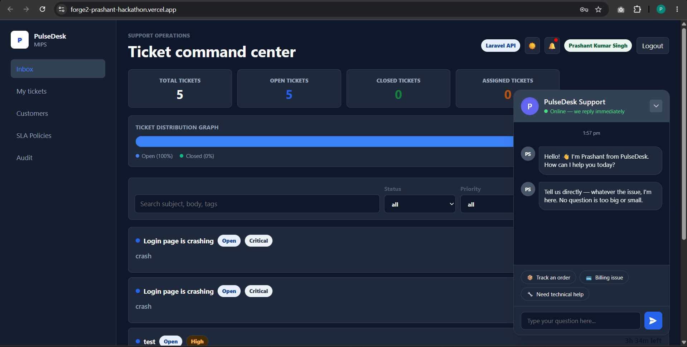

# PulseDesk - Forge 2 Hackathon

PulseDesk is a multi-tenant support-desk SaaS for the Forge 2 main hackathon. It uses a Laravel REST API and a React/Vite frontend, with tenant-scoped tickets, roles, conversations, SLA timers, assignment queues, audit logs, and dashboard metrics.

## Hackathon Features Showcase

### 1. Slack Integration (Multi-Channel Notifications)

We successfully integrated Slack to send real-time notifications to multiple channels simultaneously when a critical ticket is created.

**Agent Log Channel:**


**PulseDesk Team Channel:**


### 2. Live Ticket Creation (API Integrated)

The frontend successfully communicates with the live backend to authenticate users and create support tickets.

**Login Screen:**


**Ticket Dashboard (Dark Mode):**


### 3. Chat Widget and Dark Mode

We built a beautiful, fully functional chat widget that seamlessly switches between Light and Dark mode, ensuring perfect text legibility (pure white bold text in dark mode) and premium aesthetics.

**Chat Widget (Light Mode):**


**Chat Widget (Dark Mode):**


## Live URL

Frontend static demo: https://prashantsinghup64.github.io/forge2-prashantHackathon/

The live frontend ships with seeded demo data so judges can click through the product even when the Laravel API is not deployed. For the full backend flow, run the local steps below.

## Demo Logins

All seeded accounts use password `password`.

- Admin: `admin@example.com`
- Agent: `agent1@example.com`
- Customer: `customer1@example.com`
- Cross-tenant proof user: `globex@example.com`

## Stack

- Backend: PHP 8.2+, Laravel 11, Laravel Sanctum, MySQL 8
- Frontend: React 19, Vite, responsive CSS/Tailwind-ready structure
- CI: GitHub Actions installs dependencies, migrates MySQL, runs Laravel tests, lints and builds the frontend

## Exact Run Steps

1. Clone the repo.
```bash
git clone https://github.com/PrashantSinghUP64/forge2-prashantHackathon.git
cd forge2-prashantHackathon
```
2. Start MySQL and create the database.
```sql
CREATE DATABASE pulsedesk;
```
3. Configure and run the Laravel API.
```bash
cd backend
cp .env.example .env
composer install
php artisan key:generate
php artisan migrate --seed
php artisan serve
```
4. Configure and run the React frontend in another terminal.
```bash
cd frontend
cp .env.example .env
npm install
npm run dev
```
5. Open the app.
```text
http://localhost:5173
```

Use the `Laravel API` toggle on the login screen when the backend is running. Use `Demo` mode for the deployed static walkthrough.

## What Works

- Multi-tenancy: ticket queries are scoped by authenticated user organization; customers only see their own tickets.
- Auth and roles: admin, agent, customer via Sanctum token API.
- Tickets CRUD surface: create, list, filter, search, update status/priority, claim/assign.
- Conversation: public replies and agent-only internal notes.
- Dashboard metrics: totals, open, urgent, resolved, SLA breached, breach rate.
- SLA timers: backend-calculated per priority and displayed in the UI.
- Activity log: ticket create/comment/assign/update events with actor and timestamp.
- Seeded demo data: 2 tenants, Acme workspace users, 12 Acme tickets, and a Globex isolation record.

## API Routes

- `POST /api/register`
- `POST /api/login`
- `POST /api/logout`
- `GET /api/me`
- `GET /api/dashboard/metrics`
- `GET /api/tickets`
- `POST /api/tickets`
- `GET /api/tickets/{id}`
- `PATCH /api/tickets/{id}`
- `POST /api/tickets/{id}/comments`
- `POST /api/tickets/{id}/assign`

## Models Used Through EastRouter

- Hermes/orchestrator: `deepseek/deepseek-v4-pro`
- OpenClaw/coder: `z-ai/glm-5.1`

Secrets are redacted in committed agent config files and should be supplied through environment variables.
